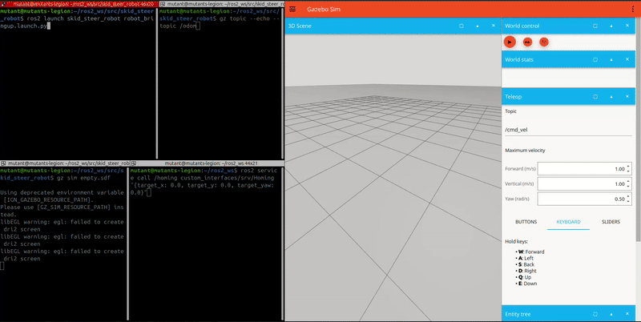
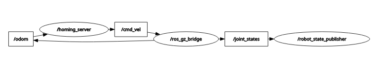
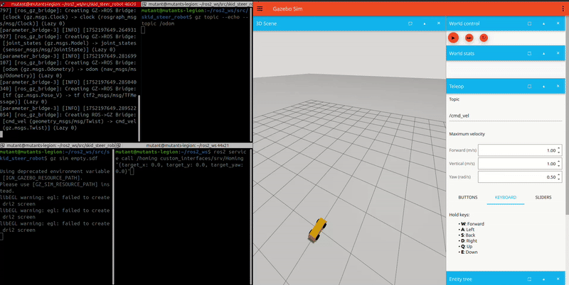

# ROS2 Service Demonstration

This repository provides a comprehensive overview of using ROS2 services which can be viewed in an interactive way through a Gazebo simulation. It also demonstrates how they can cause code blockade when used incorrectly. We will use services to trigger a function to home a 4-wheel differential drive robot.

## ⁉️ What are ROS2 Services?
Services can be considered analogous to topics. Unlike topics, which work on continuous stream of data through a publisher/subscriber model, services relay information only when requested. They consist of a client (that requests a service) and a server (that provides the service). Services are usually deemed as **synchronous** meaning the client waits till the server processes the requests. 

## 🚙 Package explained:
<p align="center">
  
  <br>
  Teleoperation and service call when /odom not publishing
</p>

This ROS 2 package simulates a differential drive robot modeled in CAD and described using a URDF. The robot uses a diff drive plugin and is launched in Gazebo, with ROS 2 communication handled through ros_gz_bridge, configured via a YAML file. The robot can be manually teleoperated through Gazebo UI. Highlight of this package is the homing_server node, which exposes a custom ROS 2 service that allows users to command the robot to home to a specified (x, y, yaw) pose. The service checks for odometry data before initiating movement. If no data is received, it safely returns false, preventing unintended motion. This project demonstrates the use of custom service interfaces and synchronous service-client communication in ROS 2. Below is the rqt_graph when the all the nodes are running:


<p align="center">
  
</p>

## 📁 Folder Structure
```
ros2_ws/
└── src/
    ├── custom_interfaces/                # 🧩 Interface package (for custom service definitions)
    │   ├── src/                       
    │   ├── srv/
    │   │   └── Homing.srv                # 🛰️ Custom service definition for homing (target_x, target_y, target_yaw)
    │   ├── CMakeLists.txt                # 🛠️ CMake build instructions (defines interface generation)
    │   └── package.xml                   # 📦 Package metadata and dependencies
    │
    └── skid_steer_robot/                 
        ├── config/
        │   └── gz_bridge.yaml            # 🔗 Config file for interfacing between Gazebo and ros2 topics
        │
        ├── launch/
        │   └── robot_bringup.launch.py   # 🚀 Launch file to start robot stack
        │
        ├── skid_steer_robot/             # 🧠 Python module with robot nodes
        │   ├── __init__.py               
        │   └── homing_server.py          # 🛰️ ROS 2 node: implements homing service logic
        │
        ├── URDF/
        │   ├── assets/                   # 🧱 CAD meshes (STL, DAE) for visualizing robot in RViz/Gazebo
        │   └── robot.urdf                # 📄 Robot description (joints, links, sensors, plugins)
        │
        ├── package.xml                   # 📦 Package metadata and dependencies
        └── setup.py                      # 🐍 Python build script for colcon
```

## 🔌 Defining a service interface:
1. Clone the custom interfaces repo in `ros_ws/src` by doing `git clone https://github.com/DumbleDuck/custom_interfaces.git`

2. `.srv` file: Just like topics, to communicate over a service we need a service definition. Services have types that describe how requests and responses are structured. This package uses a service of type `custom_interfaces/srv/Homing` and is defined as follows:
```
# Request
float64 target_x
float64 target_y
float64 target_yaw
---
# Response
bool success
string message
```
The response part defines data that needs to be sent when calling a service and response defines what data will be sent by our server.

3. CMake package dependencies: Service types are defined as a CMake package so they can be built and translated into real code. This is done when building a package and requires a translator. Hence the following commands are needed in `CMakeLists.txt`:
```
find_package(rosidl_default_generators REQUIRED)   #Defining the interface that changes .srv to real code
rosidl_generate_interfaces(${PROJECT_NAME}         #File to convert
  "srv/Homing.srv"
)
ament_export_dependencies(rosidl_default_runtime)  #Exports the runtime dependency
```
4. Package is ready to be built. Go to ros2_ws and type `colcon build --packages-select custom_interfaces`. Source the work space by performing `source ~/ros2_ws/install/setup.bash`. Once built, check if the interface is discovered by typing `ros2 interface show custom_interfaces/srv/Homing`


## 🖧 Creating a service server node:
1. Clone the repository in `ros2_ws/src` by doing `https://github.com/DumbleDuck/DiffDrive-Robot-Homing-Service.git`. Rename the folder to skid_steer_robot

2. Adding interface dependency in `package.xml`: The interface is ready and we can use it in the service server. But before that, we need to add custom interfaces as a dependency so that it can be imported as a package like this `<depend>custom_interfaces</depend>`. Purpose of other dependencies is commented in the file itself.

3. Defining the service server `homing_server.py`: This node provides the functionality of the service and is located inside `skid_steer_robot/`. In this case, the service will be used to trigger a homing command which will home our robot. Some key parts of code relevant to service are explained:
- `from custom_interfaces.srv import Homing`: importing our built service interface package.
- `class HomingServiceServer(Node):` defines the functionality of our server
	- `__init__`: creates a service called homing that uses the service interface `custom_interfaces/srv/Homing`, subscribes to `\odom` to receive robot location, publishes to `\cmd_vel` to home the robot.
	- `odom_callback(self, msg)`: subscriber callback method triggered when node receives data.
	- `homing_callback(self, request, response)`: triggered when a service request is received. Stores the provided value of `request.target_x`, `request.target_y` and `request.target_yaw` into class attributes. After having stored them, it sends a `response.message` and `response.success` indicating that command has been parsed. Note that highlighted tags correspond to the service interface definition.
	- `homing()`:This function declares the homing algorithm. It is called at every ROS tick in the background and does nothing. Whenever a service request is received, it sets off a flag that enables the core functionality. It reads the odometry data of the robot and moves it according to the user specified homing position. If the current position is in desired tolerance of the user's given position, the robot stops. 

4.  Package is ready to be built. In ros2_ws, type `colcon build --packages-select skid_steer_robot`. Source the work space by performing `source ~/ros2_ws/install/setup.bash`.

## 🚀 How to Launch:
```
source install/setup.bash                                 #Source your ROS 2 workspace
           ⬇️
gz sim empty.sdf                                          #Launch Gazebo with an empty world
           ⬇️
ros2 launch skid_steer_robot robot_bringup.launch.py      #Launch robot: spawner, ros_gz bridge, state publisher, homing_server
           ⬇️
Teleop using the keyboard only in the X-direction         #Can be expanded to full homing with better odometry
           ⬇️
ros2 service call /homing custom_interfaces/srv/Homing "{target_x: 0.0, target_y: 0.0, target_yaw: 0.0}"   #Call homing service with target position
           ⬇️
gz topic --echo --topic /odom                             #Monitor odometry topic from Gazebo
```
### Homing in action:
<p align="center">
  
  <br>
  Homing through CLI service call
</p>

## ❓ Some questions:
1. **Why can't Homing() be used as a service callback function?**   
**Ans:** Services are intended for short horizon tasks as they are synchronous and block the service server. Using a long-running function as service callback can [block the entire thread](https://docs.ros.org/en/iron/How-To-Guides/Sync-Vs-Async.html), preventing it to process further requests which can make the program unresponsive.

2. **Why choose homing through services?**  
**Ans:** The intent of this task is to show how services can be used as triggers for complex tasks. Besides, the relatively easy and quick homing algorithm employed doesn't need constant intervention and hence doesn't warrant using actions. 
The **most important** reason is to show users how long horizon task can block a server node when used as service callback. This scenario can easily be recreated in this modular code by renaming `homing()` to `homing_callback()` and storing the `request.target_x,y,yaw` as local variables rather than class attributes.

3. **Why only X homing?**  
**Ans:** The odometry data published by differential drive plugin is based on the physical model description of the robot and transforms between the chassis and the wheel. When moving in a straight line, it is quite reliable. However, due to wheel slipping while turning, it can report [erroneous values](https://robotics.stackexchange.com/questions/99374/understanding-how-odometry-is-calculated-in-the-diff-drive-controller). As this algorithm is highly sensitive to position feedback, it can cause the homing() function to enter an infinite loop. Hence, a much more robust source of odometry data (such as IMU, GPS, [Ground Truth Position Plugin](https://docs.ros.org/en/electric/api/gazebo_plugins/html/group__GazeboRosP3D.html)) is needed to perform complete homing. 
Once a reliable source of odometry is guaranteed, homing is fairly easy: aligning the yaw with the vector between current position and target position -> moving straight along the position vector until position tolerance is reached -> aligning back to target yaw.   

---